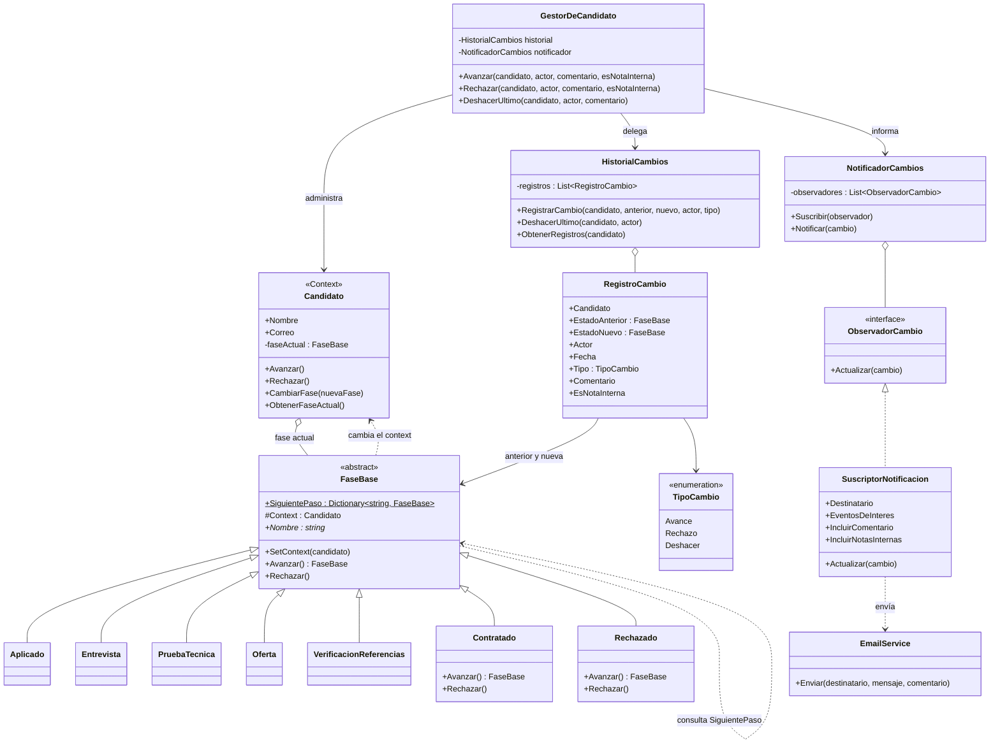

# CandidatosCore

Rediseño de **HireCore**, el sistema de seguimiento de candidatos (ATS), como parte del reto evaluativo del Bloque 1 — Principios y Patrones de Diseño.

El `GestorDeCandidato` original mezclaba transiciones de estado, reglas de notificación y lógica de deshacer en un único método con condicionales anidados. Esta versión separa esas tres responsabilidades con tres patrones de diseño, de modo que `GestorDeCandidato` no conoce el nombre de ninguna etapa, ningún destinatario de notificación, ni cómo se deshace un cambio.

## Patrones aplicados

| Patrón | Requisito que resuelve | Clases involucradas |
|---|---|---|
| **State** | Agregar etapas (ej. Prueba técnica, Verificación de referencias) sin tocar las existentes; cada etapa declara a cuál puede avanzar. | `FaseBase`, `Aplicado`, `Entrevista`, `PruebaTecnica`, `Oferta`, `VerificacionReferencias`, `Contratado`, `Rechazado` |
| **Observer** | Notificaciones diferenciadas por rol (reclutador, gerente, nómina, portal) sin que el gestor conozca a los destinatarios. | `NotificadorCambios`, `ObservadorCambio`, `SuscriptorNotificacion` |
| **Memento** | Deshacer la última transición y mantener auditoría de quién y cuándo. | `HistorialCambios` (caretaker), `RegistroCambio` (memento) |

`Candidato` es el *Context* del State: delega `Avanzar()`/`Rechazar()` en su `FaseBase` actual. Cada cambio conserva actor, fecha, comentario y si el comentario es una nota interna. `GestorDeCandidato` solo coordina: ejecuta la transición sobre el candidato, pide a `HistorialCambios` que la registre, y a `NotificadorCambios` que la informe. Cada `SuscriptorNotificacion` decide qué etapas recibe y si puede ver comentarios; el portal recibe el evento, pero no el contenido de notas internas.

## Estructura

```
src/
  CandidatosCore.Core/
    Dominio/          Candidato (Context)
    Fases/            FaseBase (con la tabla de transiciones) y las etapas concretas (State)
    Historial/        RegistroCambio, HistorialCambios (Memento)
    Notificaciones/    ObservadorCambio, NotificadorCambios, SuscriptorNotificacion (Observer)
    GestorDeCandidato.cs
  CandidatosCore.App/  Consola de demostración del flujo completo
tests/
  CandidatosCore.Tests/ Pruebas xUnit de transiciones, notificaciones y deshacer
```

## Ejecutar

```bash
dotnet run --project src/CandidatosCore.App
```

## Pruebas

```bash
dotnet test
```

## Diagrama de clases


